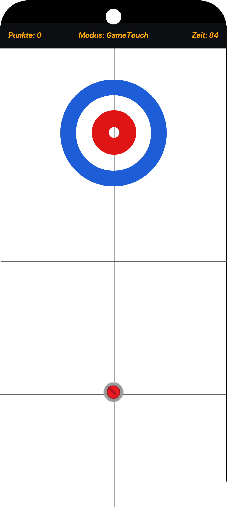

# CurlingApp

CurlingApp ist ein Curling-Spiel, das in Java mit dem Framework [libGDX](https://libgdx.com/) entwickelt wurde.  
Es wurde mit dem Projektgenerator [gdx-liftoff](https://github.com/libgdx/gdx-liftoff) erstellt und dient als Grundlage für ein physikbasiertes Sportspiel im Stil von Curling.

## Über das Spiel

CurlingApp simuliert das Wintersportspiel Curling. Der Spieler kann Steine über das Eis gleiten lassen, mit dem Ziel, sie möglichst nahe an das Zentrum des Hauses zu bringen.  
Das Spiel verwendet einfache Physik und Maus- bzw. Touch-Steuerung. Weitere Spielfunktionen sind geplant.

## Technologien

- Programmiersprache: Java  
- Framework: libGDX (für plattformübergreifende Spieleentwicklung)  
- Build-System: Gradle

## Plattformen

- `core`: Gemeinsame Spiellogik für alle Plattformen  
- `lwjgl3`: Desktop-Version (Windows, Linux, macOS)  
- `android`: Android-Version (benötigt Android SDK)

## Screenshot (Ingame)

